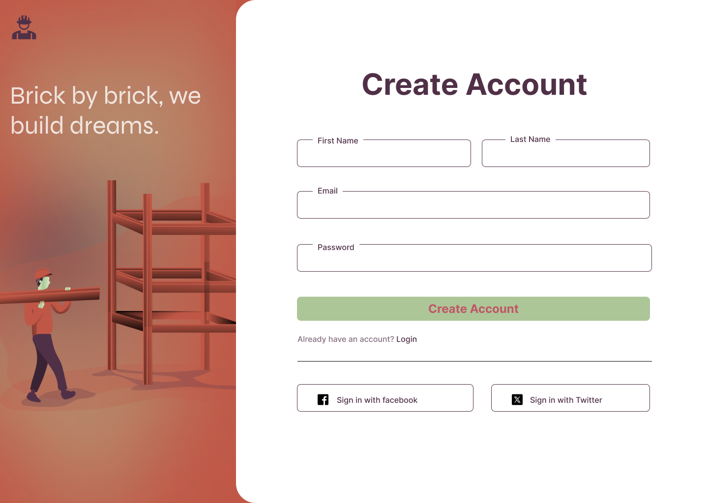

# ixd5106
A repo to store files for ixd5106.

## Learning Outcome

- Designing with elements of interaction design.
- Tools and technology used to Demonstrate form, function, and design interactions 
- Foundational theory and application understanding of Laws on interaction design
> [!Note]
Scores will be based on assignment.

> [!Warning]
Submit all the assignments.

> [!Important]
Blackboard is the best way to contact Julia.

## Sample Design

